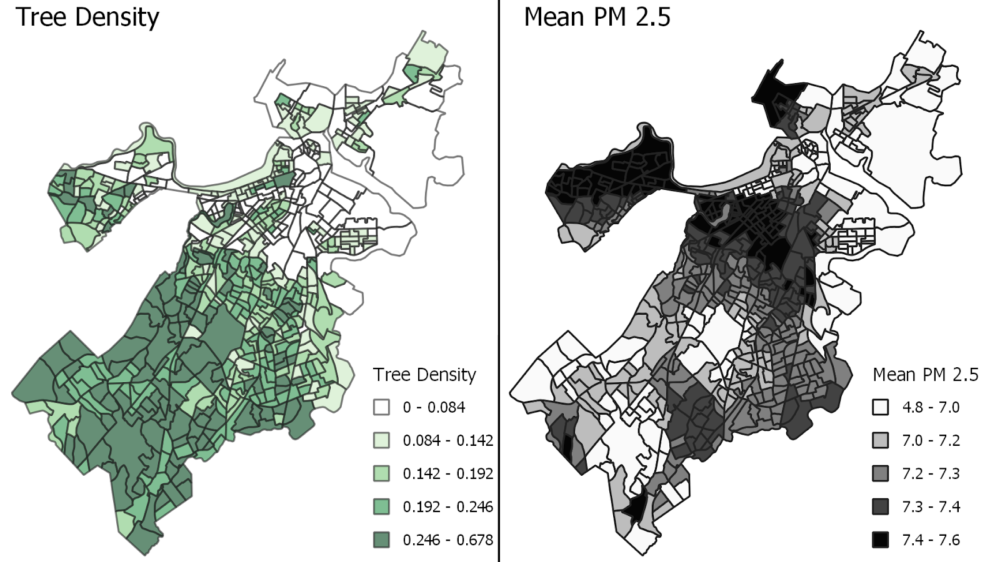
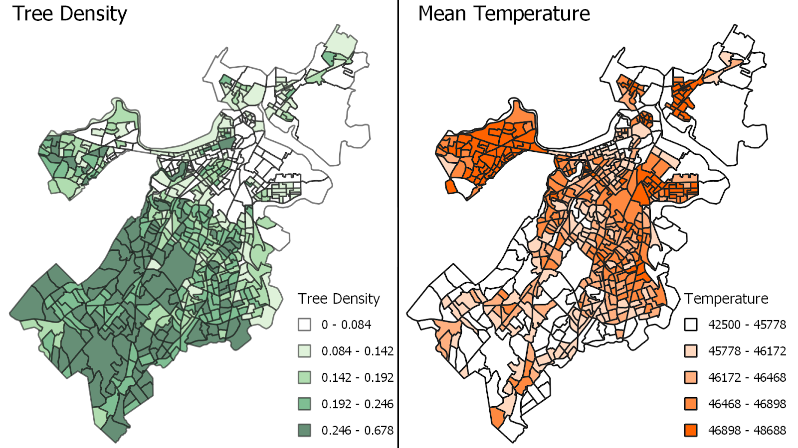

```{r message=FALSE, warning=FALSE, echo=FALSE}
knitr::opts_chunk$set(comment = NA, echo = FALSE, message = FALSE, 
                      warning = FALSE,out.width="0.9\\linewidth",
                      dev="png",fig.align  = 'center')
pacman::p_load("ggplot2","knitr","arm","data.table","foreign","car","faraway","nnet","reshape2","VGAM","sp","gstat", "tmap","sf","tidyverse","magrittr","rgdal", "dplyr","geosphere")
Sys.setenv(LANGUAGE = "en")
```


# Introduction

In the environment part, we try to relate the tree canopy to the pollution(PM2.5) and the surface heat(temperature).

### Data Source

The dataset we used are from Landsat, which are in 30x30  meters resolution. We took surface temperature and PM2.5 into account. When we first got the data, they are both raster formats, only showing some pixels on it, so we used the average of them for every small area. And also we tried to find two parts of different areas’ data and combined them together in order to make our data cover the whole Boston area. 

(Can some one add a discription about the time range of the data?)

### Method

We used the model from Demographic and combined it with tree canopy to analyze temperature and PM2.5.

1.Generate the plots which relate the canopy to Surface Temperature & PM2.5 using QGIS;

2.Do Kriging for spatial mixed effects using R.
```{r}
env <- st_read("env.shp")
env <- env[!is.na(env$mean_pm25),] #Remove rows with null columns
env <- env[!is.na(env$mean_temp),] 
env <- st_centroid(env) # Calculate centroids
# epsg_wgs84 <- 4326
# env <- env %>% st_transform(epsg_wgs84)
# ggplot(env) + geom_sf()


dem <- st_read("DemographicsSmoothed2.shp")
dem <- st_centroid(dem)
#https://stackoverflow.com/questions/49032217/inner-joining-two-sf-objects-by-non-sf-column

#join selected environment columns to demographics
env_sub <- as.data.frame(env)
env_sub <- env_sub[,c('GEOID20','mean_temp','mean_pm25')]
jn <- env_sub  %>% inner_join(as.data.frame(dem)) %>% st_sf(sf_column_name = 'geometry') 
jn %<>% st_sf(sf_column_name = 'geometry')

#Standardize the coordinate system used
epsg_wgs84 <- 4326
jn <- jn %>% st_transform(epsg_wgs84)


# variogram function
spherical_variogram <- function (n, ps, r) function (h) {
  h <- h / r
  n + ps * ifelse(h < 1, 1.5 * h - .5 * h ^ 3, 1)
}

gaussian_variogram <- function (n, ps, r)
  function (h) n + ps * (1 - exp(-(h / r) ^ 2))


exponential_variogram <- function (n, ps, r)
  function (h) n + ps * (1 - exp(-(h / r)))

# solves `A * x = v` where `C = chol(A)` is the Cholesky factor:
chol_solve <- function (C, v) backsolve(C, backsolve(C, v, transpose = TRUE)) # the solution of triangular system.The result will be a vector if 'x' is a vector and a matrix if 'x' is a matrix.

#New Kriging Function
epsilon <- 1e-3
kriging_smooth_spherical <- function (formula, data, ...) {
  v <- variogram(formula, data)
  v_fit <- fit.variogram(v, vgm("Sph",...))
  v_fit$psill[1] <- max(v_fit$psill[1], epsilon)
  v_f <- spherical_variogram(v_fit$psill[1], v_fit$psill[2], v_fit$range[2])
  
  Sigma <- v_f(as.matrix(dist(st_coordinates(data)))) # semivariogram
  Sigma <- sum(v_fit$psill) - Sigma # prior variance
  tau2 <- v_fit$psill[1] # residual variance
  C <- chol(tau2 * diag(nrow(data)) + Sigma)
  y <- model.frame(formula, data)[, 1] # response
  x <- model.matrix(formula, data)
  # generalized least squares:
  xt <- backsolve(C, x, transpose = TRUE)
  beta <- coef(lm.fit(xt, backsolve(C, y, transpose = TRUE))) # prior mean
  names(beta) <- colnames(x)
  beta_se <- sqrt(diag(chol2inv(chol(crossprod(xt)))))
  
  chol_sigma <- chol(Sigma)
  Sigma_inv <- chol2inv(chol_sigma)
  C <- chol(Sigma_inv + diag(nrow(data)) / tau2)
  # posterior mean (smoother):
  mu <- drop(chol_solve(C, y / tau2 + Sigma_inv %*% x %*% beta))
  
  sinv_mu <- chol_solve(chol_sigma, mu - x %*% beta)
  krige <- function (new_data) { # prediction function
    D <- apply(coordinates(data), 1,
               function (coord) apply(st_coordinates(new_data), 1, dist2, coord))
    V <- sum(v_fit$psill) - v_f(D)
    
    t <- delete.response(terms(formula))
    xp <- model.matrix(t, model.frame(t, new_data))
    drop(xp %*% beta + V %*% sinv_mu)
  }
  
  list(smooth = mu, prior_coef = beta, prior_coef_se = beta_se,
       variogram = v_fit, krige = krige)
}

```

\newpage
# PM2.5

### Using QGIS

```{r, echo=FALSE, fig.cap="The PM2.5 Situation in Boston", out.width = '100%'}

```

In the north west of the map, we can see there are some trees over there because we can see  the color of the tree density is green but in the PM2.5 part, it is dark one which is unusual, we guess this happens because there are many people living there.

In the middle part, There are not many trees so the air pollution is serious, which makes sense.

In the south west of the map, the trees are so dense that there is less air pollution.

If we look closely at what the images show us, we can see two strange things.

(1) Around the middle,there is a park here. Although there are a lot of trees in the park, we think the air should be flowing, so there should also be a degree of air pollution because the surroundings have a high level of PM2.5. But the level is low here.

(2) Second one is about the north east of the map—here is the airport. Generally speaking, the air problem at the airport should be serious, but maybe because the airport is in a coastal area, the air quality is not very serious.


### PM2.5 Model

Based on the spherical variogram assumptions and krigring smooth function, predictors obtained from demographic group such as smoothed income, income residual, logarithmic form of population density, smoothed tree canopy and tree canopy residual are included in the testing variogram assumptions and obtain the smoothed PM2.5 data. Including the residual predictors aims to avoid spatial confounding. In other words, similar variogram relationships between predictors will not be included when there is actually no variogram relationship between them. 

```{r}
#Calculate variograms for mean_pm25
formula <- mean_pm25 ~ 1 + Mdn_Inc_s  + Mdn_Inc_r +log(PpDnsty) + tr_smth + tre_rsd
dt <- jn
v <- variogram(formula, dt)
v_fit <- fit.variogram(v, vgm("Sph")) #'vgm':generate a variogram model or add to an existing model.
v_f <- spherical_variogram(v_fit$psill[1], v_fit$psill[2], v_fit$range[2]) #Create spherical variograms
#Plot the variograms
op <- par(mfrow = c(1, 2))
h <- seq(0, 8, length = 1000)

plot(v$dist, v$gamma,  pch = 19, col = "gray",
     xlab = "distance", ylab = "semivariogram") # main = "Minority Percentage"
lines(h, v_f(h))
abline(v = v_fit$range[2], col = "gray")
plot(h, sum(v_fit$psill) - v_f(h), type = "l",
     xlab = "distance", ylab = "covariogram",
     ylim = c(0, sum(v_fit$psill)))
points(0, sum(v_fit$psill), pch = 19)
abline(v = v_fit$range[2], col = "gray")
par(op)

# check smoothing:
ks <- kriging_smooth_spherical(formula, dt)
y <- jn$mean_pm25
op <- par(mfrow = c(1, 2))
plot(ks$smooth, y); abline(0, 1, col = "red")
plot(ks$smooth, type = "l", ylab = "y")
points(y, pch = 19, col = "gray")
abline(h = ks$prior_mean)
par(op)
```

Result shows that PM2.5 fits the spherical model well, with the stable value of variogram, which means the value of PM2.5 of one census block has an impact on the PM2.5 of census blocks nearby. 

```{r}
# rbind(ks$prior_coef, ks$prior_coef_se) #to see coef values
```

|PM2.5       |(Intercept)| Mdn_Inc_s |  Mdn_Inc_r |log(PpDnsty)  |  tr_smth  |    tre_rsd|
| :--:       |  :--:     |  :--:     |    :--:    |   :--:       |  :--:     |   :--:    |
|Coefficient | 28.060604 |-1.8453608 |0.020124982 | 0.003232229  |0.02885575 |-0.03057803|
|Sd.         |  1.906169 | 0.1683352 |0.007705991 | 0.004304010  |0.02328049 | 0.00616595|

Regression model result shows that the coefficients of income are negatively significant which means richer places have lower levels of PM2.5. This might be due to some specific methods dealing with the environment although tree density is not high compared to areas with less citizens living. The coefficient of logarithmic population density is comparatively not that significant which means the relationship between the PM2.5 and the population density is not certain. 

\newpage
# Temperature

### Using QGIS

```{r, echo=FALSE, fig.cap="The Temperature Situation in Boston", out.width = '100%'}

```

Next we did the same thing with temperature data. And here the conclusion from the graph is much easier. Where trees are denser, temperatures are cooler.

### Temperature Model

```{r}
#Calculate variograms for mean_temp

formula <- mean_temp ~ 1 + Mdn_Inc_s  + Mdn_Inc_r +log(PpDnsty) + tr_smth + tre_rsd
dt <- jn

v <- variogram(formula, dt)
v_fit <- fit.variogram(v, vgm("Sph")) #'vgm':generate a variogram model or add to an existing model.
v_f <- spherical_variogram(v_fit$psill[1], v_fit$psill[2], v_fit$range[2]) #Create spherical variograms
#Plot the variograms
op <- par(mfrow = c(1, 2))
h <- seq(0, 8, length = 1000)

plot(v$dist, v$gamma,  pch = 19, col = "gray",
     xlab = "distance", ylab = "semivariogram") # main = "Minority Percentage"
lines(h, v_f(h))
abline(v = v_fit$range[2], col = "gray")
plot(h, sum(v_fit$psill) - v_f(h), type = "l",
     xlab = "distance", ylab = "covariogram",
     ylim = c(0, sum(v_fit$psill)))
points(0, sum(v_fit$psill), pch = 19)
abline(v = v_fit$range[2], col = "gray")
par(op)

# check smoothing
ks2 <- kriging_smooth_spherical(formula, dt)
y2 <- jn$mean_temp
op <- par(mfrow = c(1, 2))
plot(ks2$smooth, y2); abline(0, 1, col = "red")
plot(ks2$smooth, type = "l", ylab = "y")
points(y2, pch = 19, col = "gray")
abline(h = ks2$prior_mean)
par(op)
```


Similarly, smoothed mean temperature is obtained by the same method as mentioned before in the PM2.5 model part. However, what is different is that temperature does not fit the spherical model well because there is no stable value of variogram from the variogram plot. This is partly because the temperature information is not enough when this project just focuses within the Boston area. If larger areas are considered, there might be a variogram relationship shown in the plots because in that case farther distance is considered and more temperature information is included. Also, the model does not fit well can be explained by the 30 meters by 30 meters resolution used in calculating the temperature and tree canopy. If we have a finer resolution, the variogram can also be improved. 

```{r}
# rbind(ks2$prior_coef, ks2$prior_coef_se) 
```

|Temperature|(Intercept)| Mdn_Inc_s  |Mdn_Inc_r |log(PpDnsty) |tr_smth  | tre_rsd    |
| :--:      |  :--:     |  :--:      |  :--:    |  :--:       |  :--:   |  :--:      |            
|Coefficient| 56610.397 | -1022.3532 |141.27618 |300.14727    |-2.212849| -433.00393 |
|Sd.        | 5207.884  | 470.4496   |71.46459  |35.27686     |95.797697|  65.69616  |


Regression model result shows that all the predictors coefficients are significant and we do include the main predictors related to the temperature. The smoothed income is negatively related to the temperature, which means it is hotter in richer places. The coefficient of logarithmic population density is positively correlated with the temperature and it makes sense that it is hotter in places living with more people. 

\newpage
# Before-and-After Smooth

Here we compared the original plots with the ones after smoothing both for temperature and PM2.5. We discovered that the smoothed image shows the gradient of color more clearly, which means for both temperature and PM2.5, the size of the data in each small area is affected to some extent by the size of the surrounding values. 

```{r, echo=FALSE, fig.cap="The PM2.5 Situation Before-and-After Smooth", out.width = '100%'}
knitr::include_graphics("pm25_final.png")
```


```{r, echo=FALSE, fig.cap="The Temperature Situation Before-and-After Smooth", out.width = '100%'}
knitr::include_graphics("temp_final.png")
```


\newpage
# Summary

Both PM2.5 and temperature perform well in modeling tree canopy and predictors from demographic groups from population density to income. Smoothed PM2.5 and temperature information are obtained and variances are smaller after kriging, which can be noticed when comparing the maps. 


# Reference and Source

https://data.boston.gov/dataset/census-2020-block-groups

https://www.usgs.gov/landsat-missions/landsat-provisional-surface-temperature?qt-science_support_page_related_con=0#qt-science_support_page_related_con

https://stackoverflow.com/questions/49032217/inner-joining-two-sf-objects-by-non-sf-column

https://www.youtube.com/watch?v=J-IB4_QL7Oc

http://www.goldensoftware.com/variogramTutorial.pdf

https://ggplot2-book.org/scale-colour.html


