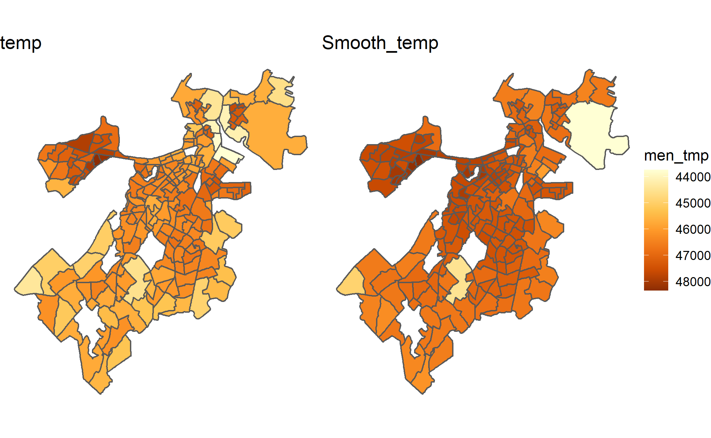
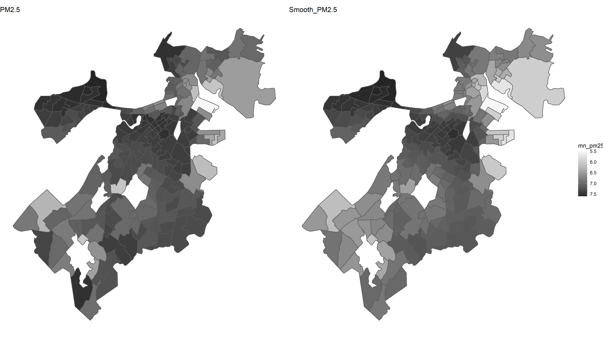

```{r message=FALSE, warning=FALSE, echo=FALSE}
knitr::opts_chunk$set(comment = NA, echo = FALSE, message = FALSE, 
                      warning = FALSE,out.width="0.9\\linewidth",
                      dev="png",fig.align  = 'center')
pacman::p_load("ggplot2","knitr","arm","data.table","foreign","car","faraway","nnet","reshape2","VGAM","sp","gstat", "tmap","sf","tidyverse","magrittr","rgdal", "dplyr","geosphere")
Sys.setenv(LANGUAGE = "en")
```

## Data source:

PM2.5:

Temperature:

Census Tracks(2020):

## Exploratory Data Analysis

### Using QGIS

We generate the plots which relate the canopy to pollution(PM2.5) and surface heat (temperature) 
```{r, echo=FALSE, fig.cap="The PM2.5 Situation in Boston", out.width = '100%'}
knitr::include_graphics("Figure1_QGIS_PM25.png")
```

```{r, echo=FALSE, fig.cap="The Temperature Situation in Boston", out.width = '100%'}

```
\newpage
### Using R

We combine the PM2.5 and temperature data to the Census2020_Tracts data, which allow us to do more exploration in R, and use krigging to avoid spacial confounding of our data.
```{r}
# data preparation
env <- st_read("env.shp")
env <- st_centroid(env)
env <- env[!is.na(env$mean_pm25),]

dem <- st_read("Demographics_Smoothed/Demographics_Smoothed/DemographicsSmoothed.shp")

#next steps 
#join selected environment columns to demographics
#https://stackoverflow.com/questions/49032217/inner-joining-two-sf-objects-by-non-sf-column

jn <- env %>%  as.data.frame() %>%  dplyr::select(GEOID20, mean_temp, mean_pm25)  %>%  inner_join(as.data.frame(dem)) %>% st_sf(sf_column_name = 'geometry')

#compute smoothed pm2.5 and temperature
```

### Plot the mean temp and PM2.5 situation for each census tract
```{r, echo=FALSE, out.width = '100%'}


```

```{r}
# env2 <- st_read("env_blockgroups/env_blockgroups.shp")
# tmap_mode("view")
#  tm_shape(env2)+
#     tm_polygons("mean_temp") + 
#     tm_borders(col="#000000", lwd=0.2)
```

```{r echo=FALSE, fig.height=5, fig.width= 6,fig.cap="The Distribution of mean_PM2.5 in Boston in 2018"}
# tmap_mode("view")
#  tm_shape(env2)+
#     tm_polygons("mean_pm25") + 
#     tm_borders(col="#000000", lwd=0.2)
```

\newpage
### Bubble Plots with centroid data
```{r echo=FALSE,results='asis',  warning=FALSE, fig.height=5, fig.width= 6,fig.cap="$Bubble Plots for mean_temp/mean_PM2.5$"}
env_centroid <-st_centroid(env)
p1<-tm_shape(env_centroid) +
  tm_bubbles(col = "mean_temp", palette = "-RdYlBu", size = .3, alpha = .75)
p2<-tm_shape(env_centroid) +
  tm_bubbles(col = "mean_pm25", palette = "-RdYlBu", size = .3, alpha = .75)
library(grid)
grid.newpage()
pushViewport(viewport(layout=grid.layout(1,2)))
print(p1, vp=viewport(layout.pos.col = 1))
print(p2, vp=viewport(layout.pos.col = 2))
```


\newpage
### Kriging for spatial mixed effects
```{r}
# Luis slides
# Helper functions
spherical_variogram <- function (n, ps, r) function (h) {
  h <- h / r
  n + ps * ifelse(h < 1, 1.5 * h - .5 * h ^ 3, 1)
}

gaussian_variogram <- function (n, ps, r)
  function (h) n + ps * (1 - exp(-(h / r) ^ 2))


exponential_variogram <- function (n, ps, r)
  function (h) n + ps * (1 - exp(-(h / r)))


# solves `A * x = v` where `C = chol(A)` is the Cholesky factor:
chol_solve <- function (C, v) backsolve(C, backsolve(C, v, transpose = TRUE)) # the solution of triangular system.The result will be a vector if 'x' is a vector and a matrix if 'x' is a matrix.

kriging_smooth_spherical <- function (formula, data, ...) {
  # formula <- mean_pm25 ~ 1
  # data <- env
  v <- variogram(formula, data)
  v_fit <- fit.variogram(v, vgm("Sph"))
  v_f <- spherical_variogram(v_fit$psill[1], v_fit$psill[2], v_fit$range[2])
  #Sigma <- v_f(as.matrix(dist(coordinates(data)))) # previous code
  Sigma <- v_f(as.matrix(dist(matrix(unlist(data$geometry), ncol = 2, byrow = TRUE)))) # semivariogram
  Sigma <- sum(v_fit$psill) - Sigma # prior variance
  tau2 <- v_fit$psill[1] # residual variance
  C <- chol(tau2 * diag(nrow(data)) + Sigma)
  y <- model.frame(formula, data)[, 1] # response
  x <- model.matrix(formula, data)
  # generalized least squares:
  beta <- coef(lm.fit(backsolve(C, x, transpose = TRUE),
                      backsolve(C, y, transpose = TRUE))) # prior mean

  Sigma_inv <- chol2inv(chol(Sigma))
  C <- chol(Sigma_inv + diag(nrow(data)) / tau2)
  # posterior mean (smoother):
  mu <- drop(chol_solve(C, y / tau2 + Sigma_inv %*% x %*% beta))
  list(smooth = mu, prior_mean = beta)
}


kriging_smooth_gaussian <- function (formula, data, ...) {
  # formula <- mean_pm25 ~ 1
  # data <- env
  v <- variogram(formula, data)
  v_fit <- fit.variogram(v, vgm("Gau"))
  v_f <- gaussian_variogram(v_fit$psill[1], v_fit$psill[2], v_fit$range[2])
  Sigma <- v_f(as.matrix(dist(matrix(unlist(data$geometry), ncol = 2, byrow = TRUE)))) # semivariogram
  Sigma <- sum(v_fit$psill) - Sigma # prior variance
  tau2 <- v_fit$psill[1] # residual variance
  C <- chol(tau2 * diag(nrow(data)) + Sigma)
  y <- model.frame(formula, data)[, 1] # response
  x <- model.matrix(formula, data)
  # generalized least squares:
  beta <- coef(lm.fit(backsolve(C, x, transpose = TRUE),
                      backsolve(C, y, transpose = TRUE))) # prior mean

  Sigma_inv <- chol2inv(chol(Sigma))
  C <- chol(Sigma_inv + diag(nrow(data)) / tau2)
  # posterior mean (smoother):
  mu <- drop(chol_solve(C, y / tau2 + Sigma_inv %*% x %*% beta))
  list(smooth = mu, prior_mean = beta)}


kriging_smooth_exponential <- function (formula, data, ...) {
  formula <- mean_pm25 ~ 1
  data <- env
  v <- variogram(formula, data)
  v_fit <- fit.variogram(v, vgm("Exp"))

  v_f <- exponential_variogram(v_fit$psill[1], v_fit$psill[2], v_fit$range[2])

  Sigma <- v_f(as.matrix(dist(matrix(unlist(data$geometry), ncol = 2, byrow = TRUE)))) # semivariogram
  Sigma <- sum(v_fit$psill) - Sigma # prior variance
  tau2 <- v_fit$psill[1] # residual variance
  C <- chol(tau2 * diag(nrow(data)) + Sigma)
  y <- model.frame(formula, data)[, 1] # response
  x <- model.matrix(formula, data)
  # generalized least squares:
  beta <- coef(lm.fit(backsolve(C, x, transpose = TRUE),
                      backsolve(C, y, transpose = TRUE))) # prior mean

  Sigma_inv <- chol2inv(chol(Sigma))
  C <- chol(Sigma_inv + diag(nrow(data)) / tau2)
  # posterior mean (smoother):
  mu <- drop(chol_solve(C, y / tau2 + Sigma_inv %*% x %*% beta))
  list(smooth = mu, prior_mean = beta)}

```

# PM2.5: check variogram and covariance 
```{r}
v <- variogram(mean_pm25 ~ 1, env)
v_fit <- fit.variogram(v, vgm("Sph")) #'vgm':generate a variogram model or add to an existing model.
v_f <- spherical_variogram(v_fit$psill[1], v_fit$psill[2], v_fit$range[2])

# check variogram and covariance
op <- par(mfrow = c(1, 2))
h <- seq(0, 26000, length = 100)
plot(v$dist, v$gamma,  pch = 19, col = "gray",
     xlab = "distance", ylab = "semivariogram")
lines(h, v_f(h))
abline(v = v_fit$range[2], col = "gray")
plot(h, sum(v_fit$psill) - v_f(h), type = "l",
     xlab = "distance", ylab = "covariogram",
     ylim = c(0, sum(v_fit$psill)),
     main = "Using Spherical Variogram")
points(0, sum(v_fit$psill), pch = 19)
abline(v = v_fit$range[2], col = "gray")
par(op)
```

```{r}
# # check smoothing of mean_pm25
# ks <- kriging_smooth_spherical(mean_pm25~ 1, env)
# y <- env$mean_temp
# op <- par(mfrow = c(1, 2))
# plot(ks$smooth, y); abline(0, 1, col = "red")
# plot(ks$smooth, type = "l", ylab = "y")
# points(y, pch = 19, col = "gray")
# abline(h = ks$prior_mean)
# par(op)
# 
# env$smooth <- ks$smooth
# breaks <- seq(4.5, 8, by = .5)
# tmap_mode("plot")
# tmap_arrange(
#   tm_shape(env) + # why not env_centroid
#     tm_bubbles(col = "response", palette = "-RdYlBu", size = .3, breaks = breaks),
#   tm_shape(env) +
#     tm_bubbles(col = "smooth", palette = "-RdYlBu", size = .3, breaks = breaks)
# )
```

# Temperature: check variogram and covariance 
```{r}
v <- variogram(mean_temp ~ 1, env)
v_fit <- fit.variogram(v, vgm("Sph")) #'vgm':generate a variogram model or add to an existing model.
v_f <- spherical_variogram(v_fit$psill[1], v_fit$psill[2], v_fit$range[2])

# check variogram and covariance
op <- par(mfrow = c(1, 2))
h <- seq(0, 26000, length = 100)
plot(v$dist, v$gamma,  pch = 19, col = "gray",
     xlab = "distance", ylab = "semivariogram")
lines(h, v_f(h))
abline(v = v_fit$range[2], col = "gray")
plot(h, sum(v_fit$psill) - v_f(h), type = "l",
     xlab = "distance", ylab = "covariogram",
     ylim = c(0, sum(v_fit$psill)),
     main = "Using Spherical variogram")
points(0, sum(v_fit$psill), pch = 19)
abline(v = v_fit$range[2], col = "gray")
par(op)
```

# Plot Smooth Data
```{r}
check <- st_read("Tree_dem_env.shp", quiet = TRUE)
t <- st_read("Census2020_Tracts/Census2020_Tracts.shp")

#join selected environment columns to demographics
data <- as.data.frame(check)
data_sub <- data[,c('GEOID20','men_tmp','mn_tmp_s', "mn_pm25", "mn_pm25_s")]
jn <- data_sub  %>% inner_join(as.data.frame(t)) %>% st_sf(sf_column_name = 'geometry') 
jn %<>% st_sf(sf_column_name = 'geometry')

#Standardize the coordinate system used
epsg_wgs84 <- 4326
jn <- jn %>% st_transform(epsg_wgs84)
library(ggpubr)

# plot
# some color reference web: https://ggplot2-book.org/scale-colour.html
pacman::p_load(paletteer)
temp <- ggplot(data = jn, aes(fill = men_tmp)) +
  geom_sf() +
  labs(title="temp") +
  paletteer::scale_fill_paletteer_c("viridis::plasma")  +
  theme(panel.grid.major = element_blank(), panel.grid.minor = element_blank(),panel.background = element_blank(), axis.line = element_line(colour = "black")) 
s_temp <- ggplot(data = jn, aes(fill = mn_tmp_s)) +
  geom_sf() +
  labs(title="Smooth_temp") +
  scale_fill_paletteer_c("viridis::plasma") +
  theme(panel.grid.major = element_blank(), panel.grid.minor = element_blank(),panel.background = element_blank(), axis.line = element_line(colour = "black")) 
ggarrange(temp, s_temp, ncol=2, common.legend = TRUE)

# another choice of color to fill the temperature
temp <- ggplot(data = jn, aes(fill = men_tmp)) +
  geom_sf() +
  labs(title="temp") +
  scale_fill_distiller(palette = "YlOrBr",trans = "reverse") +
  theme(panel.grid.major = element_blank(), panel.grid.minor = element_blank(),panel.background = element_blank(), axis.line = element_line(colour = "black")) 

s_temp <- ggplot(data = jn, aes(fill = mn_tmp_s)) +
  geom_sf() +
  labs(title="Smooth_temp") +
  scale_fill_distiller(palette = "YlOrBr",trans = "reverse") +
  theme(panel.grid.major = element_blank(), panel.grid.minor = element_blank(),panel.background = element_blank(), axis.line = element_line(colour = "black")) 
ggarrange(temp, s_temp, ncol=2, common.legend = TRUE)


pm25 <- ggplot(data = jn, aes(fill = mn_pm25)) +
  geom_sf() +
  labs(title="PM2.5") +
  scale_fill_distiller(palette = "Greys",trans = "reverse") +
  theme(panel.grid.major = element_blank(), panel.grid.minor = element_blank(),panel.background = element_blank(), axis.line = element_line(colour = "black")) 
s_pm25 <- ggplot(data = jn, aes(fill = mn_pm25_s)) +
  geom_sf() +
  labs(title="Smooth_PM2.5") +
  scale_fill_distiller(palette = "Greys",trans = "reverse") +
  theme(panel.grid.major = element_blank(), panel.grid.minor = element_blank()

ggsave("Figure3_blockTemp.png", s_temp)
ggsave("Figure4_blockPM25.png", pm25 )
```


## Citation
https://stackoverflow.com/questions/49032217/inner-joining-two-sf-objects-by-non-sf-column

https://www.youtube.com/watch?v=J-IB4_QL7Oc

http://www.goldensoftware.com/variogramTutorial.pdf

https://ggplot2-book.org/scale-colour.html


